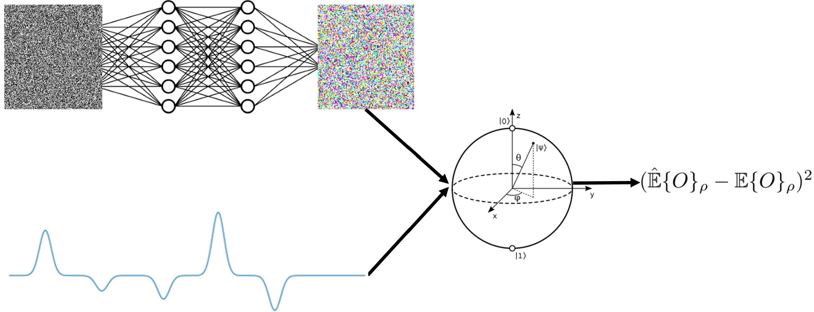

# ML for Qubit Control and System Identification

This is the public repository for my thesis work investigating the use of machine learning for qubit control and system identification. Part of this work is/was presented at the Quantum Techniques in Machine Learning (QTML) 2023 and ANZCOP-AIP Summer Meeting 2023.

For a full discussion of the work, please read z5308157_Chris_Wise_Honours_Thesis.pdf


## System Identification

### Predicting Qubit-Environment Interactions

See:
- main.py
- ./time_series_to_noise/training_wrappers.py 
- ./time_series_to_noise/utils.py.

### Transformer-based Qubit Simulator

See: 
- qubit_transformer_sim.py
- trained_transformer_for_qubit_sim.pt  
- ./time_series_to_noise/monte_carlo_qubit_simulation.py

## Qubit Control

See:
- ./control_pulse_optimisation
- ./control_pulse_optimisation_results_analysis_charts 
- ./time_series_to_noise/monte_carlo_qubit_simulation.py

## Furture Work
1. Implement divide and conquer approach for the sequential matrix products used in final timestep unitary computation
2. Add encoder-only transformer to learn control pulse disortion
3. Perform gradient-based optimisation of control pulses with transformer-based qubit simulator
4. Extend deduction of qubit-environment interactions to two qubit systems
5. Reimplement Monte Carlo qubit simulator in Mojo 🔥

## Credit
System Environment Operator Formalism and Grey Box Architecture: 
- https://www.nature.com/articles/s41534-020-00332-8
- https://github.com/akramyoussry/BQNS

Monte Carlo Qubit Simulator:
- https://www.nature.com/articles/s41597-022-01639-1
- https://github.com/eperrier/QDataSet

## Citation
```
@misc{wise2023mlqubitcontrol,
  author = {Wise, Chris},
  title = {ML for Qubit Control and System Identification},
  year = {2023},
  publisher = {GitHub},
  journal = {GitHub repository},
  howpublished = {\url{https://github.com/ChrisWise07/ML-for-Qubit-Control-Honours-Thesis}},
}
```
